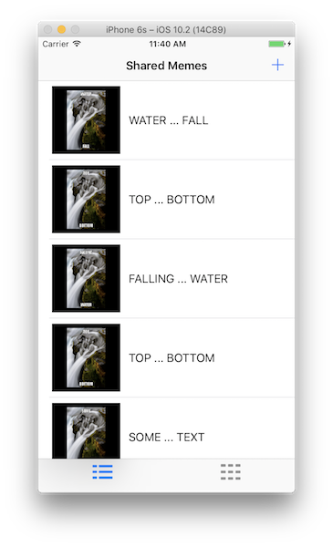
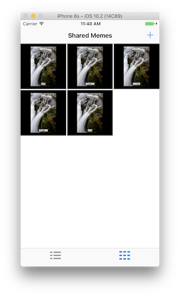
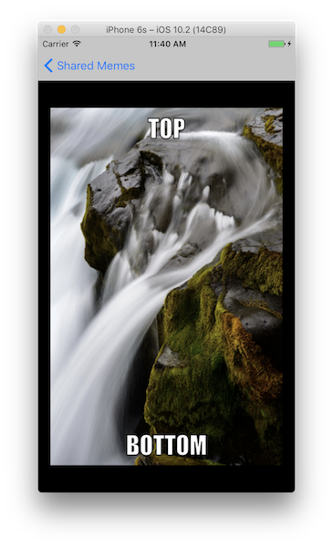

# udacity-ios-MemeMe

MemeMe is a project from the Course "UIKit Fundamentals" from Udacity:

https://www.udacity.com/course/uikit-fundamentals--ud788

## Description 

With the MemeMe iOS App a user can select a picture from the Photo Library or take a picture with the camera. Text can be added at the top and bottom of the photo. The created Meme can be shared via SMS, Twitter, Facebook or email.

Shared Memes can be displayed in a table or grid view. The grid view has a floating layout based on screen size and orientation. Selecting a shared meme either in table or grid view shows a detailed (bigger) view of the meme. 

## Topics

* Modality and Activity View and Alert Controllers
* Segues and how to present view controllers
* The Delegate Pattern explainend on UITextFieldDelegate
* Notifications and Observers
* TableViewControllers and CollectionViewControllers
* Navigation Controllers and the navigation stack
* TabViewController

## User Interface

### Generated and shared Memes

### Detailed Meme View

### Create Meme View

